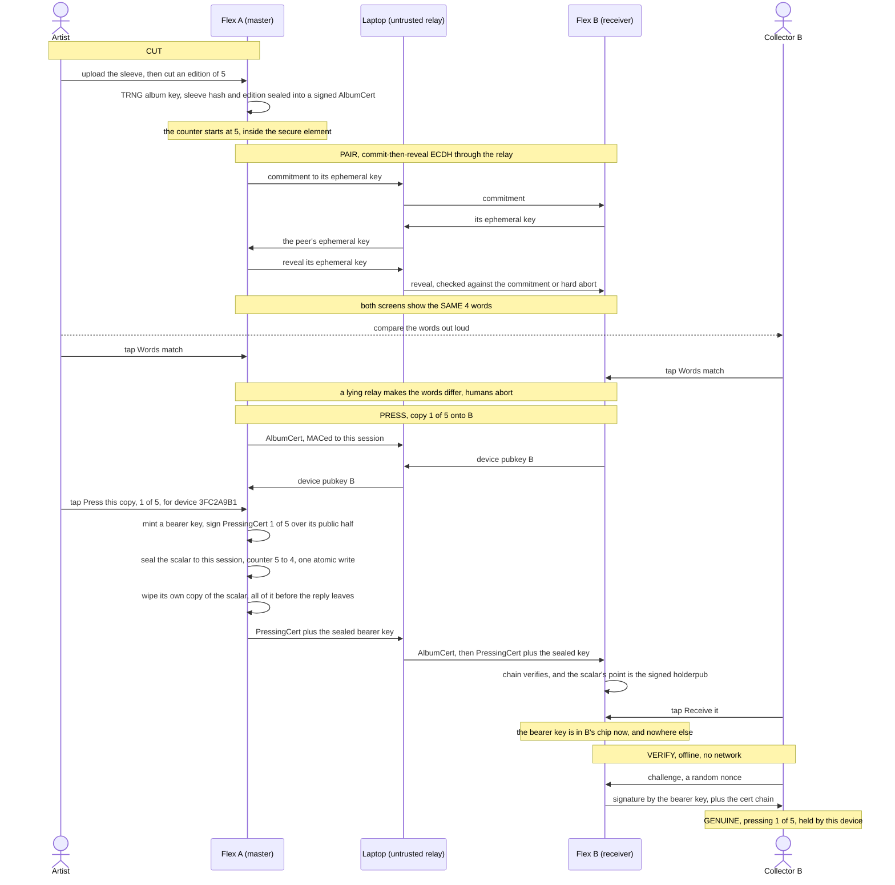
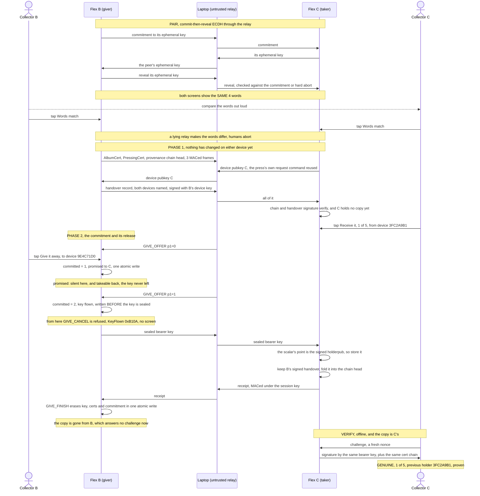

# Enclave Records

*An artist cuts a master, two Ledger Flex pair by comparing four words, a
numbered copy is pressed onto the receiver, and anyone verifies it offline.*

<!-- Maintainer: the ceremony video goes HERE, and it has to be inserted by hand.
     Open this README in the github.com editor and DRAG the mp4 into this spot:
     GitHub uploads it and writes an inline player with play/pause/scrub. An mp4
     committed to the repo and referenced by path renders only as a download
     link, which is why no link is left here. docs/demo.mp4 is the film of an
     earlier ceremony and predates the current screens (the Device ID page, the
     four-row back of the card, provenance, Learn more), so re-shoot it with
     CEREMONIE-VIDEO.md rather than posting it as it stands. For an emulator-only
     capture instead, scripts/dev/record-demo.sh stitches one from Speculos. -->

Finite editions of digital works, enforced by silicon. An artist device "cuts
a master" of an album (edition size and press counter captive in a secure
element), then "presses" numbered copies onto other devices through an
untrusted relay. A copy is bound to a **bearer key**, a secret that moves from
one secure element to the next, so it can be handed on again and again and is
never usable in two places at once. Anyone can verify a copy offline:
certificate chain + live challenge-response, no server, no chain, no trust in
the middleman.

Runs on two Ledger Flex, or on two emulated ones: the whole ceremony runs on
Speculos, which is how the test suite checks it.

## Why this is cool

Streaming turned every song, book and film into a rental. This makes a digital
work ownable again, as a numbered object with real scarcity:

- **The scarcity is physical.** The edition size lives inside a tamper-resistant
  secure element. Once an artist cuts a master of 5, even they cannot press a
  sixth. No server enforces it; no one can quietly mint more.
- **You hold one specific copy.** "4 of 5", bound to a key only your chip has,
  provable on the spot by a tap. The files can leak everywhere; being one of the
  five cannot be copied.
- **No blockchain, no account, no server.** A copy verifies offline, forever,
  against nothing but a signature. The object outlives the company that made it:
  nothing to shut down, nothing that phones home.
- **It behaves like an object.** Hand it over and it is *gone from your side*,
  like a record or a Game Boy cartridge. The cover art travels with the
  pressing, the previous holder is named beside the device that holds it now,
  and the copy can change hands any number of times without a ledger anywhere.
- **The copies cannot be enumerated.** Nothing lists who holds them. The
  artist's chip keeps the count and records the devices the first copies went
  to; past that, a copy is unknown until its holder produces it, and then it
  authenticates in seconds, offline. That is the record-shop bin: the rare
  pressing is fun *because* nobody knew it was there, and when someone comes out
  of the woodwork with a pristine #1 you can attest it on the spot. A copy does
  carry a sleeve note of its own, naming the device that handed it over and
  counting the holders before that. See [what a copy
  reveals](docs/threat-model.md#what-a-copy-reveals).

A working prototype of that idea, on hardware you can buy today.

## FAQ

Eight questions, answered as the code stands today.

**1. How do I know there's only one copy of each record?**

You can't, at the moment somebody hands it to you. A copy is a secret number
kept inside the chip. If that number ever escapes to a laptop it can be
duplicated, and every duplicate answers the possession test identically.

Two things are guaranteed. The edition size: a master cut at 5 presses 5 and
never a sixth. And a copy is never usable in two places at once while both
devices run the honest app. If a duplicate keeps changing hands, the two
histories split at one point and name the device where the split happened,
which is [detection
afterwards](docs/threat-model.md#what-the-provenance-chain-adds-and-what-it-does-not).

**2. How do I know I'm talking to a real device?**

You don't. Nothing here checks what sits at the other end of the cable. A
laptop running the right software can cut a master, press copies and take a
copy, exactly like a Flex.

The four words you read out loud prove that nobody is relaying between the two
screens. They prove nothing about what sits at the far end. Device attestation
would close this and is deliberately [not
implemented](docs/threat-model.md#attestation-and-why-it-is-not-implemented).

**3. What happens if I lose my device?**

The record is gone, permanently. There is no backup and nothing to restore. A
lost, broken or wiped Flex takes its records with it, like a fire in a record
collection.

One thing helps, and only in advance: hand each copy to a second device through
the normal ceremony before anything goes wrong. It costs foresight and a second
Flex. See [Updates and survivability](#updates-and-survivability).

**4. Can I back up my records?**

No, by design. A saved copy of the chip's memory could be put back later, and
that would let someone rewind a copy to before they gave it away, or rewind a
master to before it pressed. So the app saves nothing outside the chip and has
nothing to restore.

The same goes for updates: installing a new version of the app erases every
record on the device. Move the copies to a second device first, update, then
move them back.

**5. How do you ensure both devices run the same software?**

We don't. Nothing checks it. A modified app is a full peer in every ceremony,
and so is a laptop. The four words are silent here: they rule out a relay in
the middle and say nothing about the software at either end.

Ledger hardware can prove which binary it is running. This app does not use it,
on purpose, and the price of that decision is set out in [Attestation, and why
it is not
implemented](docs/threat-model.md#attestation-and-why-it-is-not-implemented).

**6. How does the transfer work? What assures the receiver that the sender has deleted their copy?**

The two devices pair with the four words. The receiver checks the certificates
and its owner taps first, while nothing on the giver has changed yet. The
giver's chip then goes through three states in order: **promised** to that one
device, **flown** written just before the key goes out, **gone** when the
receiver's receipt comes back and everything is erased.

The receiver's assurance rests on the secure element running the honest app. No
signature and no receipt can prove that a key is gone from somebody else's
flash. A giver running a modified app keeps the key, and the receiver never
knows.

What the protocol does guarantee: the giver falls silent at the promise, before
the key leaves. From then on it answers no challenge and can promise the copy
to nobody else, so no verifier ever sees two holders. And it erases only
against a receipt the receiver produced under the shared session key, so no
outsider can make a copy vanish. The three states are drawn out in [Giving it
on](#giving-it-on).

**7. What's the guarantee there will only be a fixed set of editions?**

The count lives in the artist's chip. The edition size is fixed at the cut and
can never be raised. Each press counts the chip down by one, and that write
lands before the certificate leaves the device, so a power cut burns a number
and never doubles one. At zero the master refuses forever. Lose or destroy that
device and the edition ends where it stands. That holds for a device running
this app; question 5 covers the other case.

Here is the limit a buyer actually faces: anybody can pick up a Flex and cut a
master with the same title, the same artist and the same edition size. The
guarantee is attached to one album key. So check the **Edition ID** on the
record card against the one the artist publishes on their own channel. Nobody
can do that step for you.

**8. How do I check a record is genuine?**

Ask the device holding it. Read its two certificates, then send it a random
number and watch it sign that number with the copy's own key. Offline, no
server, no network, and it still works years later.

That proves the copy belongs to a real edition signed by one album key, that
the number and the edition size are the signed ones, and that whatever is
answering holds the copy right now. It does not prove that the album key
belongs to the artist named on the sleeve, and it does not prove that the
responder is a real device.

## What a copy actually is

One secp256k1 scalar, the **bearer key**, plus the two certificates that make it
number N of an edition of M.

The master mints a fresh bearer key at each press, signs "copy N of M is bound
to this public key" with the album key, sends the private half to the recipient
under the paired channel, and then wipes its own copy of it. Nothing else
records who holds what. Possession of the scalar *is* possession of the copy,
and it is proven live: hand the device a random nonce, it signs it with the
bearer key or it answers "no copy here".

That one choice is what the rest of the design follows from:

- **A copy is transferable without limit.** Handing it on is sending the scalar
  and forgetting it. It costs no storage, so there is no cap on the number of
  hands.
- **The album key signs once and is then irrelevant to that copy.** The artist's
  master can be destroyed and the copies keep verifying.
- **The proof follows the key, not the hardware.** Which is also the price:
  whoever reads the scalar in flight holds the copy too. See
  [docs/threat-model.md](docs/threat-model.md).

Three files, one job each. This one is about what the object is and what it is
worth. [docs/protocol.md](docs/protocol.md) has the wire formats, the APDU map
and the state machine. [docs/threat-model.md](docs/threat-model.md) has what can
go wrong and what the guarantees rest on.

## How it works

The life of one copy, in the two ceremonies it takes: A cuts an edition of 5 and
presses **#1** onto B, then B hands that copy on to C.



A give is a press with a different signer: the giver takes the master's position
on the paired channel, asks the taker for its device key with the press's own
request command, and seals the bearer key with the same session pad, which is why
the pairing below is the block above, unchanged.



## The ceremony

1. **Cut** - Flex A asks "Cut master of *Random Access Memories* by Daft Punk?"
   and states the stakes under it: "Edition of 5, fixed forever. Losing this
   device destroys the plates."
2. **Pair** - the two devices run a commit-then-reveal ECDH through the relay;
   both screens show the same 4 words, drawn from a 256-word list. The humans
   compare them out loud: a man-in-the-middle relay cannot make the two screens
   agree.
3. **Press** - the master asks its own owner first: "Press *Random Access
   Memories* 1 of 5?", "For device 3FC2A9B1. 4 pressings will remain." Then it
   mints a bearer key, signs "pressing 1 of 5, bound to this key", seals the key
   to the paired session, decrements the counter in silicon in one atomic write,
   and wipes its own copy of the key: all of it *before* the reply leaves the
   device. At 0: sold out, forever. A power cut burns a number, it never
   duplicates one. The receiver stores the copy only if the scalar it received
   is the one the certificate names.
4. **Verify** - offline: chain verification plus a nonce the holder's secure
   element signs live with the bearer key.
5. **Give** - the copy changes hands through that same ceremony: pair, move the
   bearer key under the paired channel, prove possession on the other side. The
   giver keeps nothing. How it survives an interruption is the next section.

### Giving it on

Same four-word pairing, different payload. The recipient is asked first, on a
copy whose certificates it has already verified in full, so a refusal or a bad
certificate costs the giver nothing: it has not been asked anything yet.

**Erasing and delivering cannot be atomic across two devices.** If the write
that releases the key is also the write that erases it, a dropped cable destroys
somebody's record. So the dangerous write is a *commitment*: it records the one
recipient the copy is owed to, and the giver's state takes three values:

```
   free  --GIVE_OFFER p1=0-->  promised  --GIVE_OFFER p1=1-->  flown  --receipt-->  gone
             (one atomic          ^         (written BEFORE
              write, gated)       |          the key is sent)
                                  |
                          GIVE_CANCEL, and only from here
```

- **Promised** means a human approved exactly one recipient and the commitment
  is in flash, but the sealed key has never been on the wire. The copy is
  already silent here (it answers no challenge, and it can be offered to nobody
  else), so no verifier ever sees two holders. And because the device *knows*
  no information escaped, the promise can be taken back: `give.sh --cancel`,
  one device, one tap, and the whole copy is usable again.
- **Flown** means the key has been put on the wire. From here the copy may
  already exist elsewhere, so nothing on this device may un-promise it: a cancel
  that reached this state would be a double-spend primitive wearing a repair's
  clothes. It is refused with a status word of its own and no screen at all. The
  only way out is the recipient's receipt.
- Either state is **resumable**: re-run the ceremony with the same two devices
  and it completes, without asking the giver again (the commitment in flash is
  already the record of that approval). Aimed at any *other* recipient, both
  halves are refused for good.

### The screen tells the truth

An unfinished transfer must not look like a finished one, or nobody knows a
device has to be reconnected. So:

- a promised copy's library row reads `#1 of 5 - promised, reconnect 9E4C71D0`,
  naming the fingerprint of the device the copy is owed to. Both committed states
  say the same thing, deliberately: the owner's next move is identical either way,
  which is to find that device. `GET_INFO` reports them separately, because a
  relay offering a cancel does need to tell them apart;
- a device holding nothing prints its own `Device ID` under the empty state,
  so the device named by that row can actually be identified in a drawer of
  identical Flexes;
- the empty state also distinguishes "No records yet" from "No records here /
  You gave your copy away".

### Provenance

On the record's `Device ID` page, beside the device that holds it now:

- **the previous holder**, named by fingerprint. Exactly one hop, and it is the
  one hop this device can prove on its own: the giver signs a handover record
  naming both devices with its device key, and the taker stores it.
- **a count of the holders before that**, not their names. The page is four rows
  tall and does not scroll, and the trail is unbounded.

Behind the count is the **provenance chain**: one 32-byte rolling hash, rooted in
the copy's own signed identity, into which every transfer folds the giver's
signed handover. The giver signs the head it received, so a link belongs to one
moment of one copy's history and nothing else. Forging a link, editing a head in
flight, replaying an older link or grafting one from another copy are all refused
at the transfer, where the unsigned trail this replaces could be rewritten at
will by whoever happened to be holding the record.

It is 32 bytes at one hop and at a thousand, and a receiver checks it in constant
time, because one signature per hop would be 2.3 KB and fits nowhere on this
device. The price of that is honest and worth stating: a receiver holds a
commitment, not the witnesses, so it cannot replay a history it is handed. A
*modified* app can still claim its copy never travelled, and the lie is caught by
comparison rather than at the door.

Which is the point. A copy is a bearer key, so a copy that ever reaches software
can be cloned, and every clone verifies as genuine; attestation would prevent
that and is [not
implemented](docs/threat-model.md#attestation-and-why-it-is-not-implemented), by
decision. What the chain does is make
the clones **name their maker**: two duplicates that keep circulating produce two
histories that diverge at one link, signed by the device where the copy split.
Duplication is proven when both branches show possession. Detection and
attribution, not prevention, and the whole reasoning is in
[docs/threat-model.md](docs/threat-model.md#what-the-provenance-chain-adds-and-what-it-does-not).

One chain shown on its own settles nothing in either direction: a clone's head is
equally valid, equally signed, and grows from the same public root. The chain is
comparative evidence, and [the three things a holder does with
one](docs/threat-model.md#what-a-holder-does-with-a-chain) are a verifier's work,
off the device.

What the device does carry is the head itself, on a `History` sub-page of its
own behind `Device ID`: its first 64 bits as **eight words** from the same list
the pairing uses. Sixty-four bits because a forger fabricating a history can
grind it offline until his head matches over whatever prefix a screen shows, and
32 bits (the width of a `Device ID`) does not survive that. Read them against
what somebody wrote down the last time they saw the copy; a verifier holding the
32-byte head from `GET_BUNDLE p1=2` renders the same eight, by the rule in
[docs/protocol.md](docs/protocol.md#the-provenance-chain).

## Threat model

Two promises:

1. **A copy is never duplicated.**
2. **A copy is never lost by accident.**

Promise 1 wins wherever the two conflict, so this design breaks promise 2: every
ambiguous moment resolves toward "possibly lost, definitely not doubled".
Scarcity is the whole product, and a duplicate costs more than a loss.

Promise 1 rests on two things: the secure element genuinely erasing a key it
reports as erased, and **two humans reading four words to each other**. Confirm
mismatched words on both screens and the relay in the middle keeps a working copy
of the record, permanently and undetectably. That is the only way a second copy
can ever come into existence, and it is why the four words are the one moment
nobody should rush.

Three things this does not do, by decision: it does not attest that the peer is a
genuine Ledger (any Ledger works, and no company sits in the trust path), it does
not back anything up (a restorable snapshot would be a rollback primitive), and
it has no witness device (designed but not built, see below).

[**docs/threat-model.md**](docs/threat-model.md) carries the case analysis: what
each promise rests on, [what attestation would have
cost](docs/threat-model.md#attestation-and-why-it-is-not-implemented) and why it
is not implemented, every way a copy can be lost with its window and its
ordinary physical analogue, the interruption that costs nothing, what a copy
reveals when it is shown, what is out of scope, and the non-goals in full.

## Updates and survivability

**Uninstalling this app destroys everything it holds, and updating it is an
uninstall.** Device key, album key, counter, the bearer key of the copy held:
all of it lives in `.nvm_data`, which BOLOS wipes when the app is removed, and
every update removes and reloads the app. There is no flag to set.

This is permanent by design. BOLOS *does* offer a place for app data to survive
an update (App Storage, a `.storage_section` that Ledger Live backs up and
restores) and **this app deliberately declares none**, because that
backup carries no freshness: a restorable snapshot of this NVM is a
**state-rollback primitive**, and rewinding a master to before its last presses
or a copy to before it was given away is exactly what every invariant here
forbids. Nothing to restore because nothing was ever saved. The full reasoning is
in [docs/protocol.md](docs/protocol.md#updates-and-survivability).

**So the official update procedure is succession, not backup.** Records move the
only way they ever move, through the ceremony:

1. Hand each held copy to a second device with the normal give, four words and
   all. A master cannot be handed on, so a device holding one either keeps the
   old app or accepts that the edition ends there.
2. Update the emptied device.
3. Hand the copies back, again through the ceremony.

Slower than a backup, and that is the whole point: every hop is two humans
reading four words to each other, and at no moment is a copy usable twice.
**The PC is only ever a cable, never a vault.** It relays frames it cannot read,
and the one thing it must never become is a place where a copy of a device's
state sits waiting to be put back.

## Designed but not built

None of these exists in the code. They are recorded here so nobody reads a
capability into the project that is not there.

- **The witness.** A third chip that lends its memory to a transfer, so a copy
  could be backed up, or sent to someone who is not in the room, without the
  snapshot becoming replayable. It is the obvious answer to both the "device
  destroyed at rest" and "recipient never returns" cases, and it is why App
  Storage was rejected outright: the freshness that a Ledger Live backup lacks
  is exactly what a live third party can supply.
- **Who can serve as a witness at all.** Attestation is not implemented here, so
  a witness device says nothing about itself, which is most of what you would
  want from one. Building it means pinning a Ledger issuer key, with [the
  multi-issuer wall and the trust root that come
  with it](docs/threat-model.md#attestation-and-why-it-is-not-implemented). The
  one exception is the **artist's master**: it can prove
  possession of the album key that every copy's certificate is signed under, so
  it is verifiable by anybody holding a copy without any attestation at all.
  That makes the artist the natural witness for their own edition. Note that
  even this needs a command that does not exist yet: today `CHALLENGE` proves
  possession of a bearer key only, never of an album key.
- **A board of witnesses.** A public place where anyone posts the 204-byte
  witness read off a copy, so a duplicate surfaces the day two histories of one
  number are up there. A public chain in the NFT sense is *constitutive*: the
  token is the ledger entry, and with the ledger gone there is no object. A board
  of observed witnesses is *evidentiary*: the copy verifies and transfers without
  it, and losing it costs only the chance of noticing a clone earlier. That is
  what makes it compatible with a design whose first principle is no chain and no
  server. Post the witness rather than a bare head, so a reader checks the last
  hop instead of trusting the board: a false entry is noise that nothing signs,
  and several boards may coexist and disagree without harm. Likely form: a public
  append-only repository anyone adds to, append-only by nature, timestamped by
  its commits, no server, forkable by whoever distrusts it. The level past that
  is the one not to build, a registry a copy has to check in with, which puts
  back exactly the dependency this design refuses.

## Layout

- `device-app/` - the Ledger app (Rust, `#![no_std]`, NBGL), targets Flex
- `tests/` - pytest over one or two Speculos instances, including adversarial
  relay tests (MITM key substitution, bearer-key substitution, replay, SAS
  grinding, cert tampering, forged receipts, interrupted transfers, cancel
  abuse) and screen-geometry assertions
- `relay/` - the untrusted relay: emulator cockpit (two clickable screens +
  live APDU wire on `:5050`), ceremony driver, give driver, development
  provisioning, HID transport for real devices
- `scripts/` - the dozen commands you actually run: build, sideload, tests,
  emulators, ceremony, give, pre-flight. `scripts/dev/` holds the development
  archaeology (NVM-ceiling probes, SDK spelunking, screen captures);
  `scripts/windows/` holds the two PowerShell files, which exist only to forward
  USB into WSL and have no Linux or macOS equivalent
- `docs/protocol.md` - wire formats, APDU map, state machine, per-attack test
  status. The implementer's document.
- `docs/threat-model.md` - the two promises and which one is sacrificed, what the
  security rests on, why attestation is not implemented, how a copy can be lost,
  what is out of scope.
- `CEREMONIE-VIDEO.md` - the filmed-ceremony runbook for two physical Flex
  (French), including what to point the camera at.

## Run it

Toolchain: rustup + `cargo-ledger` + clang + `gcc-arm-none-eabi`, the
[ledger-secure-sdk](https://github.com/LedgerHQ/ledger-secure-sdk) checked out at
`API_LEVEL_26` (`FLEX_SDK`, default `~/ledger-secure-sdk`), and Python with
`ledgerblue` + `speculos` + `pytest`. Python is Ledger's own toolchain, so it is
not optional on any platform. Then:

```
scripts/build.sh        # cargo ledger build flex, this checkout
scripts/test.sh         # 73 tests, one or two emulated Flex
scripts/rehearse-emu.sh --auto    # cut, pair, press, verify on two emulators
scripts/emu-up.sh       # two persistent emulators (:5001, :5002)
scripts/cockpit.sh      # both screens + the APDU wire on :5050
python3 relay/demo_steps.py art   # then: cut, pair, press, verify
```

`scripts/env.sh` derives the repo root from its own path, so every script acts on
the checkout it lives in. `APP_DIR`, `APP_ELF` and `FLEX_SDK` are defaults: export
one and it wins. It also adds `~/.cargo/env` and `~/venv-ledger/bin` when they
exist, and skips them silently when they do not, so a machine with cargo,
speculos and pytest already on `PATH` needs no editing at all.

**On Linux or macOS, ignore `scripts/windows/` entirely.** Those two PowerShell
files forward a USB device into WSL, a problem that exists only on Windows: a
Ledger plugged into Linux or macOS is already visible to the host. Nothing else
in `scripts/` is platform-specific. `scripts/dev/` is development archaeology
(NVM-ceiling probes, SDK symbol dumps, screen captures) and can be ignored until
you need it.

`demo_steps.py` takes one ceremony beat per invocation, against the emulators
`emu-up.sh` started: `art` uploads the sleeve (before the cut, since the cut
hashes it into the certificate), then `cut`, `pair`, `press`, `verify`. There is
no give beat: a transfer is `tests/test_give.py` in emulation, or
`scripts/give.sh` on hardware.

On real hardware: `scripts/preflight.sh` (read-only), `scripts/ceremony.sh`
(cut, pair, press, verify), `scripts/give.sh` (hand a copy on, `--cancel` to
take a promise back). See [CEREMONIE-VIDEO.md](CEREMONIE-VIDEO.md) for the full
runbook and [docs/m5-hardware.md](docs/m5-hardware.md) for sideloading and
USB-to-WSL passthrough.

One build-time trap worth knowing before you touch the Rust: the app boots only
inside a *window* of code size, and dies silently in both directions outside it,
so **deleting code can break the app**. `AGENTS.md` has the measured numbers and
the boot-check procedure.

## What ships today

Everything above except *Designed but not built* and the non-goals listed in
[docs/threat-model.md](docs/threat-model.md):
cut, pair, press, offline verify, give (three-state commitment, cancel, resume),
sleeve art sealed into the album certificate, the library, the record card and
the sub-pages behind it (the number, the Edition ID, the Device ID with the
provenance on it, the History that reads the chain head as eight words, and
Learn more). 73 tests over one or two emulated Flex, and the ceremony filmed on
two physical ones.

Not shipping, by decision: remote attestation, any backup, the witness, and the
board of witnesses.
