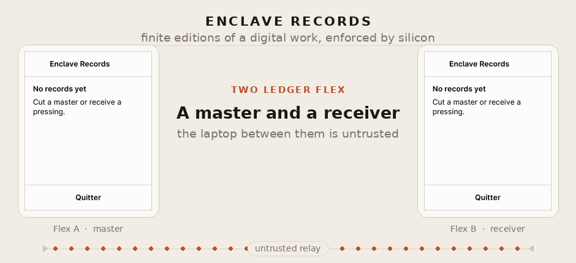
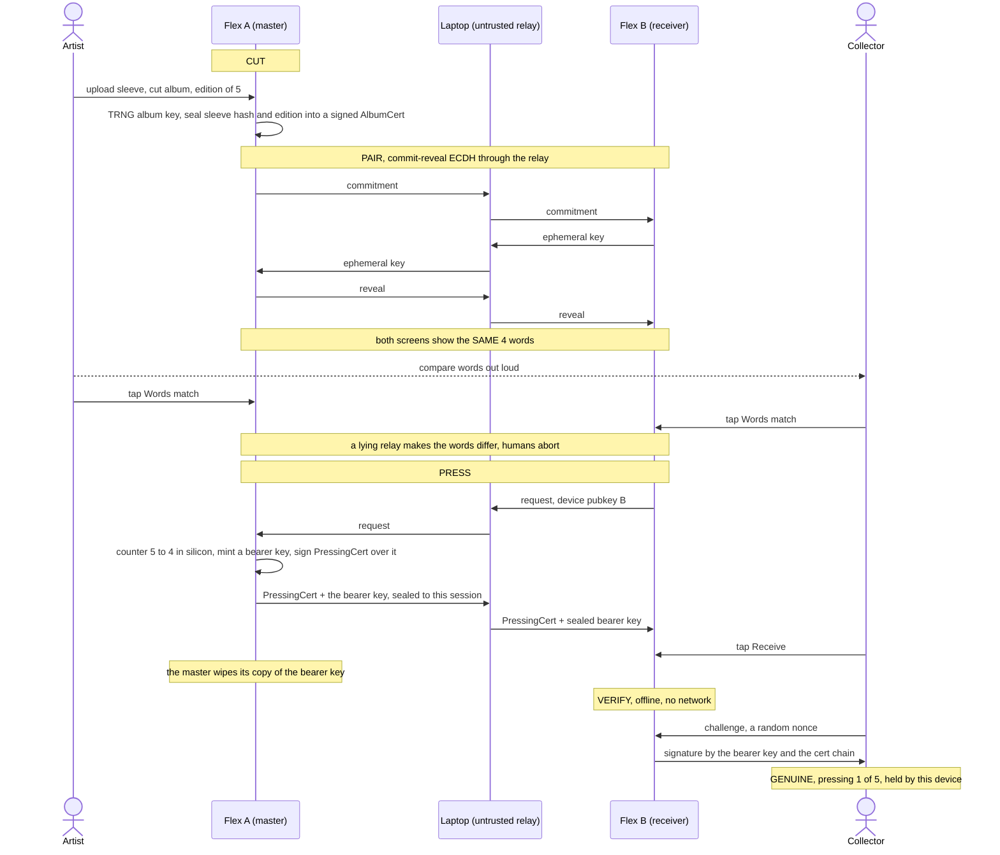
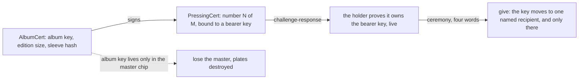

# Enclave Records



*An artist cuts a master, two Ledger Flex pair by comparing four words, a numbered copy is pressed onto the receiver, and anyone verifies it offline.*
▶ [Watch the video (pausable)](docs/demo.mp4)

<!-- Maintainer: to get an inline HTML5 player with play/pause/scrub controls,
     open this README in the github.com editor and DRAG docs/demo.mp4 into it;
     GitHub uploads it and rewrites the link as an embedded player. A committed
     mp4 referenced by path (as above) renders only as a download link. The GIF
     stays for zero-click inline autoplay. -->

Finite editions of digital works, enforced by silicon. An artist device "cuts
a master" of an album (edition size and press counter captive in a secure
element), then "presses" numbered copies onto other devices through an
untrusted relay. A copy is bound to a **bearer key**, a secret that lives in one
secure element at a time, so it can be handed on again and again, and at no
moment does it exist in two places. Anyone can verify a copy offline:
certificate chain + live challenge-response, no server, no chain, no trust in
the middleman.

Runs on two Ledger Flex (or two emulated ones: everything below works with
zero hardware).

## Why this is cool

Streaming turned every song, book and film into a rental. This makes a digital
work ownable again, as a numbered object with real scarcity:

- **The scarcity is physical, not promised.** The edition size lives inside a
  tamper-resistant secure element. Once an artist cuts a master of 5, even they
  cannot press a sixth. No server enforces it; no one can quietly mint more.
- **You hold one specific copy.** "4 of 5", bound to a key only your chip has,
  provable on the spot by a tap. The files can leak everywhere; being one of the
  five cannot be copied.
- **No blockchain, no account, no server.** A copy verifies offline, forever,
  against nothing but a signature. The object outlives the company that made it:
  nothing to shut down, nothing that phones home.
- **It behaves like an object.** Hand it over and it is *gone from your side*,
  like a record or a Game Boy cartridge. The cover art travels with the
  pressing, the previous holder is named on the back of the card, and the copy
  can change hands any number of times without a ledger anywhere.

A working prototype of that idea, on hardware you can buy today.

## What a copy actually is

One secp256k1 scalar, the **bearer key**, plus two certificates that name it.

The master mints a fresh bearer key at each press, signs "copy N of M is bound
to this public key" with the album key, sends the private half to the recipient
under the paired channel, and then wipes its own copy of it. Nothing else
records who holds what. Possession of the scalar *is* possession of the copy,
and it is proven live: hand the device a random nonce, it signs it with the
bearer key or it answers "no copy here".

That one choice is what the rest of the design follows from:

- **A copy is transferable without limit.** Handing it on is sending the scalar
  and forgetting it. It costs no storage, so there is no cap on the number of
  hands. (A chain of signed delegations, the obvious alternative, grows by one
  link per transfer and runs out of certificate room around sixteen.)
- **The album key signs once and is then irrelevant to that copy.** The artist's
  master can be destroyed and the copies keep verifying.
- **The proof follows the key, not the hardware.** Which is also the price:
  whoever reads the scalar in flight holds the copy too. See the threat model.

`docs/protocol.md` has the wire formats, the APDU map and the state machine.
This file is about what the object is and what it is worth.

## How it works





## The ceremony

1. **Cut** - Flex A confirms "Cut master of *Random Access Memories*, edition of 5".
   The edition size is fixed forever; losing the device destroys the plates.
2. **Pair** - the two devices run a commit-then-reveal ECDH through the relay;
   both screens show the same 4 words, drawn from a 256-word list. The humans
   compare them out loud: a man-in-the-middle relay cannot make the two screens
   agree.
3. **Press** - A signs "pressing 1 of 5, bound to this bearer key" and its
   counter decrements in silicon, atomically, *before* the certificate leaves.
   At 0: sold out, forever. A power cut burns a number, it never duplicates one.
4. **Verify** - offline: chain verification plus a nonce the holder's secure
   element signs live with the bearer key.

### Giving it on

Same four-word pairing, different payload. The recipient is asked first, on a
copy whose certificates it has already verified in full, so a refusal or a bad
certificate costs the giver nothing: it has not been asked anything yet.

Then the giver's side, and it is the one part of this project that is not
obvious. **Erasing and delivering cannot be atomic across two devices.** If the
write that releases the key is also the write that erases it, a dropped cable
destroys somebody's record. So the dangerous write is a *commitment*, not a
deletion, and the giver's state has three values rather than two:

```
   free  --GIVE_OFFER p1=0-->  promised  --GIVE_OFFER p1=1-->  flown  --receipt-->  gone
             (one atomic          ^         (written BEFORE
              write, gated)       |          the key is sent)
                                  |
                          GIVE_CANCEL, and only from here
```

- **Promised** means a human approved exactly one recipient and the commitment
  is in flash, but the sealed key has never been on the wire. The copy is
  already silent here (it answers no challenge, and it can be offered to nobody
  else), so no verifier ever sees two holders. And because the device *knows*
  no information escaped, the promise can be taken back: `give.sh --cancel`,
  one device, one tap, and the whole copy is usable again.
- **Flown** means the key has been put on the wire. From here the copy may
  already exist elsewhere, so nothing on this device may un-promise it: a cancel
  that reached this state would be a double-spend primitive wearing a repair's
  clothes. It is refused with a status word of its own and no screen at all. The
  only way out is the recipient's receipt.
- Either state is **resumable**: re-run the ceremony with the same two devices
  and it completes, without asking the giver again (the commitment in flash is
  already the record of that approval). Aimed at any *other* recipient, both
  halves are refused for good.

### The screen tells the truth

An earlier build showed "given away" the moment a copy was promised, so an
interrupted transfer looked exactly like a finished one and nobody knew a device
had to be reconnected. Now:

- a promised copy's library row reads `#1 of 5 - promised, reconnect 3FC2A9B1`,
  naming the fingerprint of the device the copy is owed to. Both committed
  states say the same thing, deliberately: the owner's next move is identical
  either way (find that device), and the row's job is to be actionable, not
  precise about internals. `GET_INFO` reports the two separately, because a
  relay offering a cancel does need to tell them apart;
- a device holding nothing prints its own `Device ID` under the empty state,
  so the device named by that row can actually be identified in a drawer of
  identical Flexes;
- the empty state also distinguishes "No records yet" from "No records here /
  You gave your copy away".

### Provenance

On the back of the record, beside `Device ID` (the device holding it now):

- **the previous holder**, named by fingerprint. Exactly one hop, and it is the
  one hop that is *proven*: the giver signs a handover record naming both
  devices with its device key, and the taker stores it.
- **a count of the holders before that**, not their names. Up to 32
  fingerprints travel with the copy, but nothing signs them, so printing them
  would dress an unproven trail as evidence. A count says the same true thing in
  a fixed number of characters, which also happens to be the only version that
  fits: the page is four rows tall and does not scroll.

## Threat model

### The two promises

1. **A copy is never duplicated.**
2. **A copy is never lost by accident.**

When those two conflict, and they do conflict (see the three states above),
**this design sacrifices the second**. Scarcity is the object: a system that
occasionally loses a record is a system with a bad day, a system that
occasionally duplicates one has nothing left to sell. So every ambiguous moment
resolves toward "possibly lost, definitely not doubled", and the engineering
effort goes into making the windows where that can happen small and visible
rather than into closing them with a mechanism that could also un-spend a copy.

### What the security actually rests on

Two things, and only one of them is cryptography.

**The secure element genuinely erasing the key.** When a giver completes a
handover, the protocol cannot prove to anyone that the scalar is gone from the
giver's flash. Nothing in a certificate, a signature or a receipt can establish
that. It is the chip's guarantee, not the protocol's: the app writes the erase
in a single power-loss-atomic NVM update, and BOLOS plus the secure element are
what make that write mean what it says. Extract a key from a Ledger secure
element and the whole thing falls over. That is the explicit bet, taken openly.

**Two humans reading four words aloud.** The pairing is commit-then-reveal ECDH
with a 32-bit short authentication string rendered as four words. A relay in the
middle running two handshakes ends up with two different session keys, hence two
different sets of words, and the humans are supposed to notice. Grinding is
blocked twice (the commitment forbids choosing an ephemeral key after seeing the
peer's, and pairing attempts are capped at 8 per power cycle), so an attacker
cannot search the 32-bit space online.

Say it plainly: **this is a human link, and it is the only way a second copy of
a record can ever come into existence.** A relay in the middle plus two people
who confirm without really comparing means the relay holds a session key on each
side, unmasks the bearer key in flight, and keeps a working copy of it. That
copy is permanent, undetectable, and indistinguishable from the real one,
because it *is* the real one. There is no revocation, no log, nothing to notice
later.

This is a real cost of transferability, and it is worth naming as such. In the
earlier device-bound design the same attack merely wasted a press. A copy that
can be handed on by sending a key can be stolen by reading that key. Which is
why the four words are the moment the whole ceremony is built around, and the
one moment nobody should rush.

### Why there is no attestation, and what that costs

The gap: nothing proves to a peer that the device across the cable is a genuine
Ledger running this unmodified app. A collector's Flex will happily verify a
certificate chain minted by a laptop pretending to be a master, and a
*modified* app could in principle press a sixth copy of an edition of five.

The reason this is not fixed is not that it was overlooked. It is that a Ledger
app cannot do it, and the honest version of it would have changed what the
project is:

- **A Ledger app cannot prove to a peer that it is a Ledger.** The endorsement
  mechanism (two slots, `ENDORSEMENT_SLOT_1` and `_2`) gives an app a key it can
  sign with, but the certificate an app can read back over that key is the one
  written by whichever host ran the provisioning. It attests to the *endorser*,
  not to Ledger. There is no syscall at this API level that hands an app a
  Ledger-signed device certificate to show a peer.
- **Ledger's own endorsement path is dead.** The HSM that used to sign
  endorsements, `hsmprod.hardwarewallet.com`, does not resolve at all (verified:
  NXDOMAIN).
- **Provisioning is a one-way door.** The revoke syscall is gone from the API 26
  bindings this app builds against. Two slots, no way back: burn them wrong and
  the device is done.

So the strongest true claim available was never "attested by Ledger". It was
"attested by Enclave Records, which checked this device's Ledger certificate at
press time" (option A), and it comes with a business model attached: Enclave
would have to be the party that provisions and ships the device with the record
on it, because that check can only happen while Enclave physically holds it. No
buying your own Flex and receiving a copy onto it.

**The choice made here was option B: any Ledger works, and the four words remain
the guard.** It is a priced decision, not an omission. What is bought: anyone can
join the edition with hardware they already own, and there is no company in the
trust path, which is the point of the object outliving the company. What is
paid: a modified app is not detectable by a peer, and the fallback against
over-pressing is fraud evidence rather than prevention (two certificates bearing
the same number are mutually incriminating, and a transparency log would make
that instant).

### How a copy can be lost

Each of these is real, each has a window, and each has an ordinary physical
analogue. None of them can result in two copies.

- **The device is destroyed while the copy sits at rest.** Window: forever.
  Permanent, unrecoverable, and it is the holder's choice: this app declares no
  backup, so there is nothing to restore. Like a fire in a record collection.
- **The recipient's chip dies between the key flying and the receipt.** Window:
  a few seconds, cable connected, both devices in front of you. The giver is
  stuck at "flown" with a recipient that will never answer. Like the post losing
  a parcel while you watch.
- **A recipient who commits and never comes back.** Window: social, not
  technical. The giver's copy is promised and silent, and if the key has not
  flown yet it can be taken back with one tap. If it has, the copy is stuck for
  good. Like handing something to someone who walks off: nothing technical will
  fix it, and the fix that would (letting the giver un-promise it unilaterally)
  is exactly a double spend.
- **A firmware or app update with no succession.** Window: whenever you press
  the update button. App NVM does not survive a reinstall, and every update is a
  reinstall, so routine maintenance destroys the record. See the next section.

**And the one that is not a loss, though it looks like one:** *any* interruption
of a ceremony. A dropped frame, a yanked cable, a device that goes to sleep, a
take that ends mid-transfer. Re-run the ceremony with the same two devices and
it completes, and the screen tells you which device to go and get. Nothing about
an interrupted transfer costs the copy.

### Explicitly out of scope

- **Breaking the secure element.** Extracting a key from the chip breaks
  everything, and it is a stated bet, not a defended boundary.
- **The development provisioning path.** `relay/provision.py` plus
  `PROVISION_ALBUM` / `PROVISION_PRESSING` let a laptop act as the master: it
  mints the album key and the bearer key itself, signs both certificates, and
  pushes the result onto a device. It exists to stage a filmed scene (the honest
  route to "copy #15 of 20" is fourteen earlier presses to fourteen devices),
  and what it fabricates is *authorship*, documented as fictional. The device
  still runs every check a real receive runs, and still refuses to overwrite a
  copy it holds, so this adds a holding and never removes one. But note: it is
  **compiled into the current build, not behind a feature flag, and not gated by
  a confirmation on screen**, and its bearer key crosses the USB cable in the
  clear with no session to seal it. This is a lab prototype. Do not read the
  current binary as a shippable product.

### Deliberate non-goals

- **The cover is public, not secret.** The sleeve travels through the untrusted
  relay; integrity comes from the signed hash, not from secrecy. A swapped cover
  fails the hash and the device silently falls back to generative art. Fine for
  artwork, not a model for private payloads.
- **Losing the master ends the edition.** The album key exists only in the
  master's chip and is never backed up. A master cannot be handed on either.
  This is "the plates are destroyed", chosen on purpose.
- **One pressing per device.** A device can hold its own master and one
  pressing, not two pressings.
- **Sideload only.** Not in Ledger's catalog.
- **The relay is assumed hostile and left that way.** No effort goes into
  making it trustworthy, because the design does not need it to be.

## Updates and survivability

**Uninstalling this app destroys everything it holds, and updating it is an
uninstall.** Device key, album key, counter, the bearer key of the copy held:
all of it lives in `.nvm_data`, which BOLOS wipes when the app is removed, and
every update removes and reloads the app. There is no flag to set.

This is not a gap a later version will close. BOLOS *does* offer a place for app
data to survive an update (App Storage, a `.storage_section` that Ledger Live
backs up to the phone or desktop and restores afterwards) and **this app
deliberately declares none**. The reason is that the backup/restore protocol
carries no freshness: nothing in it tells the device whether the blob coming
back is the state it last wrote, or that state as it was an hour, a month, a
hundred presses ago. A restorable snapshot of this app's NVM is therefore a
**state-rollback primitive**: rewind a master to before its last presses and
press those numbers again; rewind a copy to before it was given away and hold it
while the recipient holds it too. Every invariant here rests on a counter that
only counts down and a commitment that is never widened, and a rollback undoes
exactly those two. Declaring no storage section is not a missing feature, it is
anti-rollback by construction: nothing to restore because nothing was ever
saved. The price is total non-survivability, paid knowingly.

**So the official update procedure is succession, not backup.** Records move the
only way they ever move, through the ceremony:

1. Hand each held copy to a second device with the normal give, four words and
   all. A master cannot be handed on, so a device holding one either keeps the
   old app or accepts that the edition ends there.
2. Update the emptied device.
3. Hand the copies back, again through the ceremony.

Slower than a backup, and that is the whole point: every hop is two humans
reading four words to each other, and at no moment does a copy exist twice.
**The PC is only ever a cable, never a vault.** It relays frames it cannot read,
and the one thing it must never become is a place where a copy of a device's
state sits waiting to be put back.

## Designed, not built

Neither of these exists in the code. They are recorded here so nobody reads a
capability into the project that is not there.

- **The witness.** A third chip that lends its memory to a transfer, so a copy
  could be backed up, or sent to someone who is not in the room, without the
  snapshot becoming replayable. It is the obvious answer to both the "device
  destroyed at rest" and "recipient never returns" cases, and it is the reason
  App Storage was rejected rather than merely postponed: the freshness that a
  Ledger Live backup lacks is exactly what a live third party can supply.
- **Who can serve as a witness under option B.** With no attestation, a witness
  device cannot prove it is a genuine Ledger, which is most of what you would
  want from one. The one exception is the **artist's master**: it can prove
  possession of the album key that every copy's certificate is signed under, so
  it is verifiable by anybody holding a copy without any attestation at all.
  That makes the artist the natural witness for their own edition. Note that
  even this needs a command that does not exist yet: today `CHALLENGE` proves
  possession of a bearer key only, never of an album key.

## Layout

- `device-app/` - the Ledger app (Rust, `#![no_std]`, NBGL), targets Flex
- `tests/` - pytest over one or two Speculos instances, including adversarial
  relay tests (MITM key substitution, bearer-key substitution, replay, SAS
  grinding, cert tampering, forged receipts, interrupted transfers, cancel
  abuse) and screen-geometry assertions
- `relay/` - the untrusted relay: emulator cockpit (two clickable screens +
  live APDU wire on `:5050`), ceremony driver, give driver, HID transport for
  real devices
- `scripts/` - build (WSL/aarch64-friendly), emulators, sideloading, captures
- `docs/protocol.md` - wire formats, APDU map, state machine, per-attack test
  status. The implementer's document.
- `CEREMONIE-VIDEO.md` - the filmed-ceremony runbook for two physical Flex
  (French), including what to point the camera at.

## Run it

Toolchain (Linux/WSL): rustup + `cargo-ledger` + clang + `gcc-arm-none-eabi`,
the [ledger-secure-sdk](https://github.com/LedgerHQ/ledger-secure-sdk) checked
out at `API_LEVEL_26` (`FLEX_SDK` env var), Speculos + pytest in a venv.
Adapt `scripts/env.sh` to your paths, then:

```
scripts/build-video.sh  # cargo ledger build flex, this worktree
pytest -q tests/        # 61 tests, one or two emulated Flex
scripts/emu-up.sh       # two persistent emulators (:5001, :5002)
scripts/cockpit.sh      # clickable dual-screen cockpit + APDU wire (:5050)
python3 relay/demo_steps.py cut   # then: pair, press, verify
scripts/rehearse-emu.sh --auto    # the whole ceremony on two emulators
```

`scripts/env.sh` and the wrappers that source it (`build.sh`, `test.sh`,
`emu-up.sh`) pin `APP_DIR` to a sibling `presse` checkout, which is why this
worktree has its own `build-video.sh`, `env-video.sh` and `rehearse-emu.sh`.
Use those, or export `APP_DIR`/`APP_ELF` yourself.

On real hardware: `scripts/preflight.sh` (read-only), `scripts/ceremony.sh`
(cut, pair, press, verify), `scripts/give.sh` (hand a copy on, `--cancel` to
take a promise back). See [CEREMONIE-VIDEO.md](CEREMONIE-VIDEO.md) for the full
runbook and [docs/m5-hardware.md](docs/m5-hardware.md) for sideloading and
USB-to-WSL passthrough.

One build-time trap worth knowing before you touch the Rust: the app boots only
inside a *window* of code size, and dies silently in both directions outside it,
so **deleting code can break the app**. `AGENTS.md` has the measured numbers and
the boot-check procedure.

## What ships today

Everything described above outside the two sections labelled otherwise:
cut, pair, press, offline verify, give (three-state commitment, cancel, resume),
sleeve art sealed into the album certificate, the library, the record card,
provenance, the authenticity page. 61 tests over one or two emulated Flex, and
the ceremony filmed on two physical ones.

Not shipping, by decision rather than by schedule: remote attestation, any
backup, and the witness.
