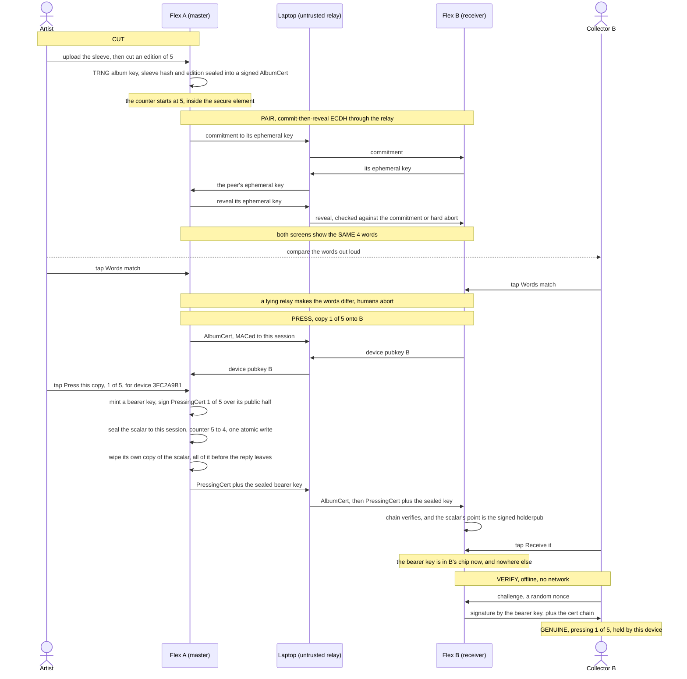
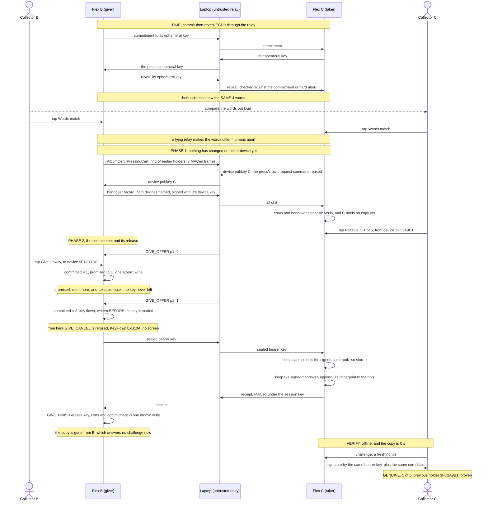

# Enclave Records

*An artist cuts a master, two Ledger Flex pair by comparing four words, a
numbered copy is pressed onto the receiver, and anyone verifies it offline.*

<!-- Maintainer: the ceremony video goes HERE, and it has to be inserted by hand.
     Open this README in the github.com editor and DRAG the mp4 into this spot:
     GitHub uploads it and writes an inline player with play/pause/scrub. An mp4
     committed to the repo and referenced by path renders only as a download
     link, which is why no link is left here. docs/demo.mp4 is the film of the
     Lot 1 ceremony and predates the current screens (the Device ID page, the
     four-row back of the card, provenance, Learn more), so re-record with
     scripts/record-demo.sh rather than posting it as it stands. -->

Finite editions of digital works, enforced by silicon. An artist device "cuts
a master" of an album (edition size and press counter captive in a secure
element), then "presses" numbered copies onto other devices through an
untrusted relay. A copy is bound to a **bearer key**, a secret that moves from
one secure element to the next, so it can be handed on again and again and is
never usable in two places at once. Anyone can verify a copy offline:
certificate chain + live challenge-response, no server, no chain, no trust in
the middleman.

Runs on two Ledger Flex, or on two emulated ones: the whole ceremony runs on
Speculos, which is how the test suite checks it.

## Why this is cool

Streaming turned every song, book and film into a rental. This makes a digital
work ownable again, as a numbered object with real scarcity:

- **The scarcity is physical.** The edition size lives inside a tamper-resistant
  secure element. Once an artist cuts a master of 5, even they cannot press a
  sixth. No server enforces it; no one can quietly mint more.
- **You hold one specific copy.** "4 of 5", bound to a key only your chip has,
  provable on the spot by a tap. The files can leak everywhere; being one of the
  five cannot be copied.
- **No blockchain, no account, no server.** A copy verifies offline, forever,
  against nothing but a signature. The object outlives the company that made it:
  nothing to shut down, nothing that phones home.
- **It behaves like an object.** Hand it over and it is *gone from your side*,
  like a record or a Game Boy cartridge. The cover art travels with the
  pressing, the previous holder is named beside the device that holds it now,
  and the copy can change hands any number of times without a ledger anywhere.

A working prototype of that idea, on hardware you can buy today.

## What a copy actually is

One secp256k1 scalar, the **bearer key**, plus the two certificates that make it
number N of an edition of M.

The master mints a fresh bearer key at each press, signs "copy N of M is bound
to this public key" with the album key, sends the private half to the recipient
under the paired channel, and then wipes its own copy of it. Nothing else
records who holds what. Possession of the scalar *is* possession of the copy,
and it is proven live: hand the device a random nonce, it signs it with the
bearer key or it answers "no copy here".

That one choice is what the rest of the design follows from:

- **A copy is transferable without limit.** Handing it on is sending the scalar
  and forgetting it. It costs no storage, so there is no cap on the number of
  hands.
- **The album key signs once and is then irrelevant to that copy.** The artist's
  master can be destroyed and the copies keep verifying.
- **The proof follows the key, not the hardware.** Which is also the price:
  whoever reads the scalar in flight holds the copy too. See
  [docs/threat-model.md](docs/threat-model.md).

Three files, one job each. This one is about what the object is and what it is
worth. [docs/protocol.md](docs/protocol.md) has the wire formats, the APDU map
and the state machine. [docs/threat-model.md](docs/threat-model.md) has what can
go wrong and what the guarantees rest on.

## How it works

The life of one copy, in the two ceremonies it takes: A cuts an edition of 5 and
presses **#1** onto B, then B hands that copy on to C.



A give is a press with a different signer: the giver takes the master's position
on the paired channel, asks the taker for its device key with the press's own
request command, and seals the bearer key with the same session pad, which is why
the pairing below is the block above, unchanged.



## The ceremony

1. **Cut** - Flex A asks "Cut master of *Random Access Memories* by Daft Punk?"
   and states the stakes under it: "Edition of 5, fixed forever. Losing this
   device destroys the plates."
2. **Pair** - the two devices run a commit-then-reveal ECDH through the relay;
   both screens show the same 4 words, drawn from a 256-word list. The humans
   compare them out loud: a man-in-the-middle relay cannot make the two screens
   agree.
3. **Press** - the master asks its own owner first: "Press *Random Access
   Memories* 1 of 5?", "For device 3FC2A9B1. 4 pressings will remain." Then it
   mints a bearer key, signs "pressing 1 of 5, bound to this key", seals the key
   to the paired session, decrements the counter in silicon in one atomic write,
   and wipes its own copy of the key: all of it *before* the reply leaves the
   device. At 0: sold out, forever. A power cut burns a number, it never
   duplicates one. The receiver stores the copy only if the scalar it received
   is the one the certificate names.
4. **Verify** - offline: chain verification plus a nonce the holder's secure
   element signs live with the bearer key.
5. **Give** - the copy changes hands through that same ceremony: pair, move the
   bearer key under the paired channel, prove possession on the other side. The
   giver keeps nothing. How it survives an interruption is the next section.

### Giving it on

Same four-word pairing, different payload. The recipient is asked first, on a
copy whose certificates it has already verified in full, so a refusal or a bad
certificate costs the giver nothing: it has not been asked anything yet.

**Erasing and delivering cannot be atomic across two devices.** If the write
that releases the key is also the write that erases it, a dropped cable destroys
somebody's record. So the dangerous write is a *commitment*: it records the one
recipient the copy is owed to, and the giver's state takes three values:

```
   free  --GIVE_OFFER p1=0-->  promised  --GIVE_OFFER p1=1-->  flown  --receipt-->  gone
             (one atomic          ^         (written BEFORE
              write, gated)       |          the key is sent)
                                  |
                          GIVE_CANCEL, and only from here
```

- **Promised** means a human approved exactly one recipient and the commitment
  is in flash, but the sealed key has never been on the wire. The copy is
  already silent here (it answers no challenge, and it can be offered to nobody
  else), so no verifier ever sees two holders. And because the device *knows*
  no information escaped, the promise can be taken back: `give.sh --cancel`,
  one device, one tap, and the whole copy is usable again.
- **Flown** means the key has been put on the wire. From here the copy may
  already exist elsewhere, so nothing on this device may un-promise it: a cancel
  that reached this state would be a double-spend primitive wearing a repair's
  clothes. It is refused with a status word of its own and no screen at all. The
  only way out is the recipient's receipt.
- Either state is **resumable**: re-run the ceremony with the same two devices
  and it completes, without asking the giver again (the commitment in flash is
  already the record of that approval). Aimed at any *other* recipient, both
  halves are refused for good.

### The screen tells the truth

An unfinished transfer must not look like a finished one, or nobody knows a
device has to be reconnected. So:

- a promised copy's library row reads `#1 of 5 - promised, reconnect 9E4C71D0`,
  naming the fingerprint of the device the copy is owed to. Both committed states
  say the same thing, deliberately: the owner's next move is identical either way,
  which is to find that device. `GET_INFO` reports them separately, because a
  relay offering a cancel does need to tell them apart;
- a device holding nothing prints its own `Device ID` under the empty state,
  so the device named by that row can actually be identified in a drawer of
  identical Flexes;
- the empty state also distinguishes "No records yet" from "No records here /
  You gave your copy away".

### Provenance

On the record's `Device ID` page, beside the device that holds it now:

- **the previous holder**, named by fingerprint. Exactly one hop, and it is the
  one hop that is *proven*: the giver signs a handover record naming both
  devices with its device key, and the taker stores it.
- **a count of the holders before that**, not their names. Up to 32 fingerprints
  travel with the copy, but nothing signs them, and a count cannot dress an
  unproven trail as evidence. It is also the only version that fits a page which
  is four rows tall and does not scroll.

## Threat model

Two promises:

1. **A copy is never duplicated.**
2. **A copy is never lost by accident.**

Promise 1 wins wherever the two conflict, so this design breaks promise 2: every
ambiguous moment resolves toward "possibly lost, definitely not doubled".
Scarcity is the whole product, and a duplicate costs more than a loss.

Promise 1 rests on two things: the secure element genuinely erasing a key it
reports as erased, and **two humans reading four words to each other**. Confirm
mismatched words on both screens and the relay in the middle keeps a working copy
of the record, permanently and undetectably. That is the only way a second copy
can ever come into existence, and it is why the four words are the one moment
nobody should rush.

Three things this does not do, by decision: it does not attest that the peer is a
genuine Ledger (any Ledger works, and no company sits in the trust path), it does
not back anything up (a restorable snapshot would be a rollback primitive), and
it has no witness device (designed, unbuilt, see below).

[**docs/threat-model.md**](docs/threat-model.md) carries the case analysis: what
each promise rests on, why a Ledger app cannot prove to a peer that it is a
Ledger and what that costs, every way a copy can be lost with its window and its
ordinary physical analogue, the interruption that costs nothing, what is out of
scope, and the non-goals in full.

## Updates and survivability

**Uninstalling this app destroys everything it holds, and updating it is an
uninstall.** Device key, album key, counter, the bearer key of the copy held:
all of it lives in `.nvm_data`, which BOLOS wipes when the app is removed, and
every update removes and reloads the app. There is no flag to set.

This is permanent by design. BOLOS *does* offer a place for app data to survive
an update (App Storage, a `.storage_section` that Ledger Live backs up and
restores) and **this app deliberately declares none**, because that
backup carries no freshness: a restorable snapshot of this NVM is a
**state-rollback primitive**, and rewinding a master to before its last presses
or a copy to before it was given away is exactly what every invariant here
forbids. Nothing to restore because nothing was ever saved. The full reasoning is
in [docs/protocol.md](docs/protocol.md#updates-and-survivability).

**So the official update procedure is succession, not backup.** Records move the
only way they ever move, through the ceremony:

1. Hand each held copy to a second device with the normal give, four words and
   all. A master cannot be handed on, so a device holding one either keeps the
   old app or accepts that the edition ends there.
2. Update the emptied device.
3. Hand the copies back, again through the ceremony.

Slower than a backup, and that is the whole point: every hop is two humans
reading four words to each other, and at no moment is a copy usable twice.
**The PC is only ever a cable, never a vault.** It relays frames it cannot read,
and the one thing it must never become is a place where a copy of a device's
state sits waiting to be put back.

## Designed, not built

Neither of these exists in the code. They are recorded here so nobody reads a
capability into the project that is not there.

- **The witness.** A third chip that lends its memory to a transfer, so a copy
  could be backed up, or sent to someone who is not in the room, without the
  snapshot becoming replayable. It is the obvious answer to both the "device
  destroyed at rest" and "recipient never returns" cases, and it is why App
  Storage was rejected outright: the freshness that a Ledger Live backup lacks
  is exactly what a live third party can supply.
- **Who can serve as a witness at all.** With no attestation, a witness device
  cannot prove it is a genuine Ledger, which is most of what you would
  want from one. The one exception is the **artist's master**: it can prove
  possession of the album key that every copy's certificate is signed under, so
  it is verifiable by anybody holding a copy without any attestation at all.
  That makes the artist the natural witness for their own edition. Note that
  even this needs a command that does not exist yet: today `CHALLENGE` proves
  possession of a bearer key only, never of an album key.

## Layout

- `device-app/` - the Ledger app (Rust, `#![no_std]`, NBGL), targets Flex
- `tests/` - pytest over one or two Speculos instances, including adversarial
  relay tests (MITM key substitution, bearer-key substitution, replay, SAS
  grinding, cert tampering, forged receipts, interrupted transfers, cancel
  abuse) and screen-geometry assertions
- `relay/` - the untrusted relay: emulator cockpit (two clickable screens +
  live APDU wire on `:5050`), ceremony driver, give driver, development
  provisioning, HID transport for real devices
- `scripts/` - build (WSL/aarch64-friendly), emulators, sideloading, captures
- `docs/protocol.md` - wire formats, APDU map, state machine, per-attack test
  status. The implementer's document.
- `docs/threat-model.md` - the two promises and which one is sacrificed, what the
  security rests on, why there is no attestation, how a copy can be lost, what is
  out of scope.
- `CEREMONIE-VIDEO.md` - the filmed-ceremony runbook for two physical Flex
  (French), including what to point the camera at.

## Run it

Toolchain (Linux/WSL): rustup + `cargo-ledger` + clang + `gcc-arm-none-eabi`,
the [ledger-secure-sdk](https://github.com/LedgerHQ/ledger-secure-sdk) checked
out at `API_LEVEL_26` (`FLEX_SDK` env var), Speculos + pytest in a venv.
Adapt `scripts/env.sh` to your paths, then:

```
scripts/build-video.sh  # cargo ledger build flex, this worktree
pytest -q tests/        # 61 tests, one or two emulated Flex
scripts/rehearse-emu.sh --auto    # cut, pair, press, verify on two emulators
scripts/emu-up.sh       # two persistent emulators (:5001, :5002)
python3 relay/demo_steps.py art   # then: cut, pair, press, verify
```

`scripts/env.sh` pins `APP_DIR` to a sibling `presse` checkout, and most scripts
source it, so they run the sibling's build and not this one. It overrides
whatever the caller exported, so only the four scripts that set their own paths
target this worktree: `build-video.sh`, `load-video.sh`, `env-video.sh` and
`rehearse-emu.sh`. To use any of the others here, edit `env.sh` first. That
includes `emu-up.sh` above, and `cockpit.sh` (the dual-screen cockpit and APDU
wire on `:5050`), which additionally runs the sibling checkout's `relay/`.

`demo_steps.py` takes one ceremony beat per invocation, against the emulators
`emu-up.sh` started: `art` uploads the sleeve (before the cut, since the cut
hashes it into the certificate), then `cut`, `pair`, `press`, `verify`. There is
no give beat: a transfer is `tests/test_give.py` in emulation, or
`scripts/give.sh` on hardware.

On real hardware: `scripts/preflight.sh` (read-only), `scripts/ceremony.sh`
(cut, pair, press, verify), `scripts/give.sh` (hand a copy on, `--cancel` to
take a promise back). See [CEREMONIE-VIDEO.md](CEREMONIE-VIDEO.md) for the full
runbook and [docs/m5-hardware.md](docs/m5-hardware.md) for sideloading and
USB-to-WSL passthrough.

One build-time trap worth knowing before you touch the Rust: the app boots only
inside a *window* of code size, and dies silently in both directions outside it,
so **deleting code can break the app**. `AGENTS.md` has the measured numbers and
the boot-check procedure.

## What ships today

Everything above except *Designed, not built* and the non-goals listed in
[docs/threat-model.md](docs/threat-model.md):
cut, pair, press, offline verify, give (three-state commitment, cancel, resume),
sleeve art sealed into the album certificate, the library, the record card and
the four sub-pages behind it (the number, the Edition ID, the Device ID with the
provenance on it, and Learn more). 61 tests over one or two emulated Flex, and
the ceremony filmed on two physical ones.

Not shipping, by decision: remote attestation, any backup, and the witness.
